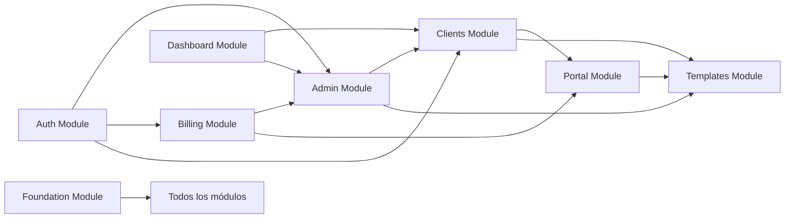

# 🔗 Cross-Module Integration Report

**Fecha**: 2026-01-27
**Objetivo**: Analizar las interfaces y dependencias entre módulos para detectar gaps, race conditions, y puntos de falla.

---

## 📊 Mapa de Módulos y Dependencias



---

## 🔴 INTEGRACIÓN 1: Auth → Billing

### Flujo Esperado
```
Usuario completa signup → Se crea org → Se crea customer en Stripe → Trial inicia
```

### Gaps Detectados

#### 1.1 Stripe Customer Creation Timing
| Pregunta | Respuesta Documentada |
|----------|----------------------|
| ¿Cuándo se crea el Stripe Customer? | ❌ No definido |
| ¿Durante el signup o al primer intento de upgrade? | ❌ No definido |
| ¿Se guarda `stripe_customer_id` antes o después de crear org? | ❌ No definido |

**Problema**: Si se crea el customer de Stripe DESPUÉS del signup, y esa llamada falla:
- Org existe sin customer
- Usuario no puede acceder a billing portal
- Se requiere soporte manual

**Solución Propuesta**:
```typescript
// Crear customer DURANTE onboarding (atómico)
export async function createAccountAction(data: SignupData) {
  return await db.transaction(async (tx) => {
    // 1. Crear org
    const org = await tx.insert(organizations).values({ name: data.orgName });
    
    // 2. Crear Stripe customer INMEDIATAMENTE
    const customer = await stripe.customers.create({
      email: data.email,
      metadata: { org_id: org.id }
    });
    
    // 3. Actualizar org con customer_id
    await tx.update(organizations)
      .set({ stripe_customer_id: customer.id })
      .where(eq(organizations.id, org.id));
    
    // 4. Crear profile
    // ...
  });
}
```

#### 1.2 Trial Start Date
| Pregunta | Respuesta Documentada |
|----------|----------------------|
| ¿Dónde se guarda `trial_ends_at`? | ❌ No hay campo en schema |
| ¿Quién calcula cuándo acaba el trial? | ❌ No definido |

**Problema**: El schema solo tiene `plan_status` pero NO `trial_ends_at`. ¿Cómo sabe el sistema cuándo expira?

**Solución**: Agregar campo a organizations:
```sql
alter table organizations add column trial_ends_at timestamptz;
```

---

## 🔴 INTEGRACIÓN 2: Billing → Portal

### Flujo Esperado
```
Plan expira → Usuario no puede crear nuevos casos → Portales existentes siguen funcionando
```

### Gaps Detectados

#### 2.1 Plan Expiration vs Portal Access
| Pregunta | Respuesta Documentada |
|----------|----------------------|
| ¿Los portales activos funcionan si el plan expira? | ❌ No definido |
| ¿Se bloquea la creación de NUEVOS portales? | ❌ No definido |
| ¿Se notifica al cliente del portal que hay problemas? | ❌ No definido |

**Escenario Problemático**:
```
1. Abogado tiene plan Pro con 50 clientes activos
2. Payment fails → plan_status = 'past_due'
3. Cliente #37 intenta completar su portal
4. ¿Funciona? ¿Se bloquea? ¿Ve error?
```

**Decisión Requerida**:
| Opción | Comportamiento |
|--------|----------------|
| A: Graceful | Portales existentes funcionan, nuevos bloqueados |
| B: Strict | Todo bloqueado hasta que pague |
| C: Grace Period | 7 días de gracia, luego bloqueo total |

**Implementación (Opción A - Recomendada)**:
```typescript
// Portal: Solo verificar que el case existe y no está expirado
// NO verificar el plan_status de la org
export async function getPortalDataAction(token: string) {
  const case = await supabase
    .from('cases')
    .select('*, client:clients(*)')
    .eq('token', token)
    .gt('expires_at', new Date().toISOString())
    .single();
  
  return case; // No verificamos org.plan_status aquí
}

// Crear Caso: SÍ verificar plan
export async function createCaseAction(clientId: string) {
  const profile = await getCurrentProfile();
  
  // Verificar que org puede crear casos
  const org = await supabase
    .from('organizations')
    .select('plan_status')
    .eq('id', profile.org_id)
    .single();
  
  if (org.data.plan_status !== 'active') {
    return { error: 'PAYMENT_REQUIRED' };
  }
  
  // Crear caso...
}
```

---

## 🔴 INTEGRACIÓN 3: Auth → Clients

### Flujo Esperado
```
Usuario nuevo → Tiene acceso a 0 clientes → Admin le asigna o crea propios
```

### Gaps Detectados

#### 3.1 Nuevo Miembro Sin Clientes
| Pregunta | Respuesta Documentada |
|----------|----------------------|
| ¿Qué ve un member nuevo en /clientes? | ❌ No definido |
| ¿Puede crear clientes propios? | ⚠️ Implícito (sí por RLS) |
| ¿Admin ve botón "Asignar Cliente"? | ❌ No hay UI definida |

**Problema**: Nuevo member se loguea → Lista vacía → ¿Qué hace? ¿Cómo sabe qué hacer?

**Solución**: Onboarding UX para members nuevos
```tsx
function ClientsPage() {
  const clients = await getMyClients();
  
  if (clients.length === 0) {
    return (
      <EmptyState
        title="¡Bienvenido al equipo!"
        description="Aún no tienes clientes asignados. Tu administrador puede asignarte clientes existentes o puedes crear uno nuevo."
        actions={[
          { label: "Crear Mi Primer Cliente", action: openCreateModal },
          { label: "Solicitar Asignación", action: notifyAdmin },
        ]}
      />
    );
  }
  
  return <ClientsList clients={clients} />;
}
```

#### 3.2 Lawyer Deletion Impact
| Pregunta | Respuesta Documentada |
|----------|----------------------|
| ¿Qué pasa con los clientes cuando se borra un lawyer? | ✅ `SET NULL` en FK |
| ¿Se notifica a alguien? | ❌ No |
| ¿Aparece alerta en admin? | ❌ No |

**Problema**: Lawyer sale de la empresa → Sus clientes quedan sin abogado asignado → Nadie se entera

**Solución**:
```sql
-- Trigger cuando se borra un profile
create or replace function notify_orphaned_clients()
returns trigger as $$
begin
  -- Crear notificación para admins
  insert into notifications (org_id, type, message, metadata)
  select 
    old.org_id,
    'CLIENTS_ORPHANED',
    'El abogado ' || old.full_name || ' fue removido. ' || 
    count(*) || ' clientes necesitan reasignación.',
    jsonb_build_object('client_ids', array_agg(c.id))
  from clients c
  where c.assigned_lawyer_id = old.id
  group by old.org_id, old.full_name;
  
  return old;
end;
$$ language plpgsql;
```

---

## 🟠 INTEGRACIÓN 4: Clients → Templates

### Flujo Esperado
```
Crear caso → Seleccionar template → Template se copia a case.template_snapshot
```

### Gaps Detectados

#### 4.1 Template Deleted After Case Creation
| Pregunta | Respuesta Documentada |
|----------|----------------------|
| ¿Qué pasa si se borra el template original? | ✅ Case tiene snapshot |
| ¿El case mantiene referencia al template_id? | ❌ No hay campo template_id |
| ¿Se puede ver "de qué template vino" un caso? | ❌ No hay trazabilidad |

**Problema**: Sin `template_id` en cases, no podemos:
- Saber cuántos casos usaron un template
- Actualizar casos si el template se "mejora"
- Ofrecer "recrear con template actualizado"

**Solución**:
```sql
alter table cases add column template_id uuid references templates(id) on delete set null;
```

#### 4.2 Private Template vs Shared Case
| Pregunta | Respuesta Documentada |
|----------|----------------------|
| ¿Lawyer A puede usar template privado de Lawyer B? | ❌ No por RLS |
| ¿Qué pasa si Admin asigna un cliente con caso de template privado? | ❌ No definido |

**Escenario**:
```
1. Lawyer A crea template privado "Divorcio Express"
2. Lawyer A crea caso para Cliente usando ese template
3. Admin reasigna Cliente a Lawyer B
4. Lawyer B abre el caso
5. ¿Lawyer B puede ver el template_snapshot? 
   → Sí, está en el case
6. ¿Lawyer B puede crear NUEVOS casos con ese template?
   → No, es privado de A
```

**Decisión**: El `template_snapshot` aísla el problema. No hay gap real aquí.

---

## 🟠 INTEGRACIÓN 5: Templates → Portal

### Flujo Esperado
```
Template JSON → Se renderiza en Portal → Cliente ve los pasos
```

### Gaps Detectados

#### 5.1 Template Schema Versioning
| Pregunta | Respuesta Documentada |
|----------|----------------------|
| ¿Qué versión del schema soporta el Portal? | ❌ No hay versión |
| ¿Qué pasa si se agrega un nuevo type de step? | ❌ Portal crashea |

**Escenario**:
```
1. Deploy v1: Template types = [UPLOAD, AGREEMENT, TEXT]
2. Se agregan más tipos en código
3. Deploy v2: Template types = [UPLOAD, AGREEMENT, TEXT, SIGNATURE]
4. Caso viejo tiene type: SIGNATURE pero portal no lo renderiza
5. → Portal muestra error o ignora el paso
```

**Solución**: Versionado de Schema
```typescript
// Template debe tener version
interface Template {
  id: string;
  schema: {
    version: 1 | 2 | 3;
    steps: Step[];
  };
}

// Portal verifica compatibilidad
function PortalRenderer({ template }: { template: Template }) {
  if (template.schema.version < MINIMUM_SUPPORTED_VERSION) {
    return <LegacyPortalError />;
  }
  
  return <StepRenderer steps={template.schema.steps} />;
}
```

---

## 🟠 INTEGRACIÓN 6: Dashboard → All Modules

### Flujo Esperado
```
Dashboard consulta → Clients, Cases, Templates, Activity
```

### Gaps Detectados

#### 6.1 Queries Sin Optimización
| Query | Módulos Tocados | ¿Optimizado? |
|-------|-----------------|--------------|
| Total Clientes | Clients | ❌ COUNT(*) sin cache |
| Casos Activos | Cases | ❌ COUNT(*) sin cache |
| Docs Pendientes | Case_Files | ❌ JOIN + COUNT |
| Actividad Reciente | Audit_Logs | ⚠️ Index existe |

**Problema**: Dashboard hace 4+ queries pesadas en cada page load

**Solución A: Materialized View**
```sql
create materialized view dashboard_stats as
select 
  org_id,
  (select count(*) from clients where clients.org_id = o.id) as total_clients,
  (select count(*) from cases where cases.org_id = o.id and status != 'completed') as active_cases,
  (select count(*) from case_files where case_files.org_id = o.id and status = 'pending') as pending_files
from organizations o;

-- Refresh cada hora
create extension if not exists pg_cron;
select cron.schedule('refresh_dashboard_stats', '0 * * * *', 'refresh materialized view dashboard_stats');
```

**Solución B: Redis Cache**
```typescript
export async function getDashboardStats() {
  const cached = await redis.get(`dashboard:${orgId}`);
  if (cached) return JSON.parse(cached);
  
  const stats = await computeStats();
  await redis.setex(`dashboard:${orgId}`, 3600, JSON.stringify(stats));
  
  return stats;
}
```

---

## 🟡 INTEGRACIÓN 7: Admin → Team Members

### Flujo Esperado
```
Admin invita → Email enviado → Member acepta → Profile creado
```

### Gaps Detectados

#### 7.1 Invitation Flow Dependencies
| Paso | Dependencia | ¿Verificada? |
|------|-------------|--------------|
| 1. Admin invita | Tabla `invitations` | ❌ Tabla no existe |
| 2. Email enviado | Resend configurado | ❌ No mencionado |
| 3. Token validado | Invitations.token | ❌ N/A |
| 4. Profile creado | Trigger o Server Action | ⚠️ Trigger comentado |

**Problema Total**: El flujo de invitación NO PUEDE funcionar con el schema actual.

**Dependencias Faltantes**:
1. Tabla `invitations`
2. Endpoint de email (Resend)
3. Page `/join/[token]`
4. Server Action `acceptInvitationAction`

---

## 🟡 INTEGRACIÓN 8: Portal → Storage

### Flujo Esperado
```
Cliente sube archivo → Signed URL generado → Archivo va a Storage → File registrado en case_files
```

### Gaps Detectados

#### 8.1 Two-Phase Upload Race Condition
| Paso | ¿Verificado? |
|------|--------------|
| 1. Client solicita URL | ✅ Server Action |
| 2. Client sube a Storage | ⚠️ Async, puede fallar |
| 3. Client confirma upload | ❌ No hay paso de confirmación |
| 4. Server actualiza case_files | ❌ ¿Cuándo ocurre? |

**Escenario Problemático**:
```
1. Cliente solicita upload URL
2. Servidor crea registro en case_files con status='pending'
3. Cliente sube archivo a Storage
4. ¿CÓMO sabe el servidor que el upload completó?
5. Si cliente cierra browser a mitad del upload:
   → case_files dice 'pending'
   → Storage tiene archivo parcial o nada
   → Datos inconsistentes
```

**Solución: Confirmation Callback**
```typescript
// 1. Generar URL (no crear registro aún)
export async function generateUploadUrlAction(caseId: string, fileName: string) {
  const url = await supabase.storage
    .from('docs')
    .createSignedUploadUrl(`${caseId}/${fileName}`);
  
  return { uploadUrl: url, tempId: uuid() }; // Solo retornar URL
}

// 2. Confirmar upload (crear registro)
export async function confirmUploadAction(caseId: string, filePath: string, category: string) {
  // Verificar que el archivo existe en storage
  const { data } = await supabase.storage.from('docs').list(caseId);
  const exists = data?.some(f => f.name === filePath);
  
  if (!exists) {
    return { error: 'FILE_NOT_FOUND' };
  }
  
  // Ahora sí crear registro
  await supabase.from('case_files').insert({
    case_id: caseId,
    file_key: filePath,
    category,
    status: 'uploaded'
  });
}
```

---

## 🔵 RACE CONDITIONS IDENTIFICADAS

### RC-1: Signup + Trial Expiration Check
```
T0: User starts signup form
T+30s: User submits
T+30s: Trial check runs (cron job)
T+31s: User org created
Result: ¿El nuevo user cuenta como trial expirado?
```

**Solución**: Trial check debe ignorar orgs creadas en los últimos 5 minutos.

### RC-2: Portal Completion + Case Update
```
T0: Cliente en step 3 de 4
T0: Abogado abre caso, ve step 3
T+10s: Cliente completa step 4
T+15s: Abogado clickea "Aprobar" basado en step 3
Result: Datos inconsistentes
```

**Solución**: Optimistic locking con version number
```sql
alter table cases add column version int not null default 0;

-- Cada update incrementa version
update cases set status = 'review', version = version + 1
where id = ? and version = ?; -- Must match current version
```

### RC-3: Dual Tab Upload
```
T0: Cliente abre portal en Tab A
T0: Cliente abre portal en Tab B
T+5s: Tab A uploads file
T+10s: Tab B uploads SAME file (no sabe que ya subió)
Result: Archivo duplicado
```

**Solución**: Check before upload + Realtime sync (ya documentado en robustez)

---

## 📋 RESUMEN DE GAPS

| Integración | Gaps | Severidad |
|-------------|------|-----------|
| Auth → Billing | 2 | 🔴 Crítico |
| Billing → Portal | 1 | 🔴 Crítico |
| Auth → Clients | 2 | 🟠 Alto |
| Clients → Templates | 2 | 🟡 Medio |
| Templates → Portal | 1 | 🟡 Medio |
| Dashboard → All | 1 | 🟡 Medio |
| Admin → Team | 1 | 🔴 Crítico |
| Portal → Storage | 1 | 🟠 Alto |
| Race Conditions | 3 | 🟠 Alto |

**Total**: 14 gaps de integración + 3 race conditions

---

## ✅ ACCIONES REQUERIDAS

### Prioridad 1 (Bloqueantes)
1. Crear tabla `invitations` (Admin → Team no funciona sin esto)
2. Definir Stripe customer creation timing
3. Agregar `trial_ends_at` a organizations

### Prioridad 2 (Alta)
4. Implementar confirmation callback para uploads
5. Definir comportamiento de billing expiry vs portal access
6. Crear notification system para orphaned clients

### Prioridad 3 (Media)
7. Agregar schema version a templates
8. Implementar dashboard cache strategy
9. Agregar optimistic locking para race conditions

---
