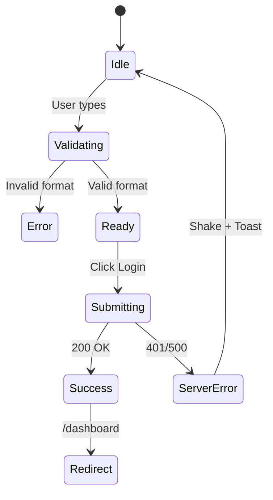

# Auth Module - Abogado Sala

Sistema de autenticación y onboarding.

## 1. Arquitectura (`src/features/auth/`)

Ver `architecture.md` para capas.

## 2. Máquina de Estados (User Flow Detallado)

### Login Flow



### Register Flow (Onboarding)

1. **Paso 0**: Landing -> Click "Prueba Gratis".
2. **Paso 1 (Credenciales)**:
   - Input: Email, Password, Confirm Password.
   - Action: Validar disponibilidad de email `onBlur`.
3. **Paso 2 (Perfil)**:
   - Input: Nombre, Apellidos, Teléfono.
4. **Paso 3 (Organización)**:
   - Input: Nombre del Despacho.
   - _System_: Crea slug único (ej. `abogados-luz -> abogados-luz-1`).
5. **Finalización**:
   - **Action**: Invocar `createAccountAction`.
   - **Contract**: El backend debe garantizar la atomicidad (User + Profile + Org). [Ver Backend Contracts](file:///c:/code/WEB/astro/abogados/abogado-sala/.agent/backend/backend-contracts.md).
   - **CRÍTICO - Force Refresh**: El primer JWT del usuario tiene `org_id: null`. El cliente **DEBE** forzar `supabase.auth.refreshSession()` inmediatamente después de crear la Org para recibir el nuevo claim `org_id`.

### Invite Flow Security (Anti-Hijack)

- **Problema**: Atacante logueado acepta invitación de otro email.
- **Validación**: `joinByInvitationAction` debe verificar:
  ```typescript
  if (session.user.email !== invitation.email)
    throw new Error("Email mismatch");
  ```

---

## 3. Escenarios "Unhappy Path" (Brutal Honesty)

### A. Race Conditions

- **Problema**: Usuario hace doble click en "Crear Cuenta".
- **Solución**: El botón debe pasar a estado `disabled` inmediatamente en `onClick`. Usar `useActionState` (React 19) o `useTransition`.

### B. Validación de Password

- No usar reglas arbitrarias complejas.
- **Regla**: Min 8 caracteres. Nada más. (NIST Guidelines).
- Feedback: Medidor de fuerza visual (barra de color).

### C. Sesión Expirada en Tab Activa

- Si el refresh token falla (401 global), interceptar en `axios/fetch`.
- **Acción**: Redirigir a `/login?redirect=...`.
- **UX**: Toast "Tu sesión ha caducado".

---

## 4. Componentes Clave

### `<AuthCard />`

Wrapper centrado con branding.

- Slot `logo`: Icono del despacho.
- Slot `title`: H1 semántico.
- Slot `content`: Formulario.
- Slot `footer`: Links a recuperar pass / registro.

### `<SocialLogin />` (Future-proof)

Aunque no se use ahora, dejar preparado el componente dividor `---- O ----`.
