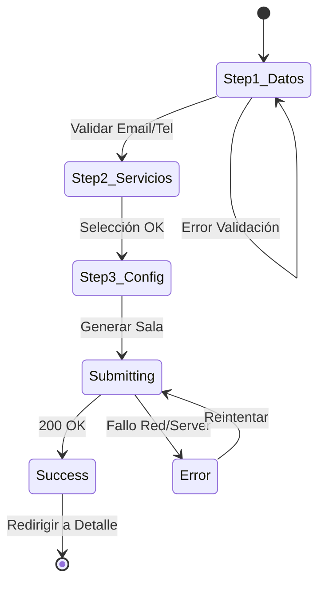

# Clients Module - Abogado Sala

Gestión de clientes y expedientes.

## 1. Arquitectura (`src/features/clients/`)

Ver `architecture.md`.

## 2. Visibilidad de Datos (Scope)

### Query Strategy (Server Actions)

La seguridad está en la **Database Query**, no solo en filtros de UI.

> **Ver Contrato Backend**: La lógica exacta de filtrado SQL se ha movido a [`backend/backend-contracts.md`](file:///c:/code/WEB/astro/abogados/abogado-sala/.agent/backend/backend-contracts.md) para mantener este archivo puramente Frontend.

### UI Implications

- **Tabla de Lawyer**: No muestra columna "Asignado a" (siempre es él).
- **Tabla de Admin**: Muestra columna "Abogado Responsable" y permite filtrar.

## 3. Expediente Detail View (File Handling)

### Actions Bar ("The Good Ideas from Legacy")

1.  **Compartir Link**:
    - Botón `Copy Link` (Portapapeles).
    - Botón `WhatsApp` (**NUEVO**):
      - **Flow**: Abre un `Dialog` con el mensaje pre-cargado desde el Admin Default.
      - **Personalización**: El abogado puede editar el texto libremente antes de enviar.
      - **Envío**: Al confirmar, abre `wa.me` con el texto final codificado.
2.  **Descargar Expediente (Zip)** (**NUEVO**):
    - Generación Client-Side (`jszip`).
    - **Estructura del Zip**:
      - `/documentos/`: Todos los PDFs/Imágenes renombrados (`01_DNI.pdf`).
      - `resumen.txt`: Metadata del cliente + Respuestas del Cuestionario en texto plano.
      - `auditoria.txt`: Logs e IPs del cliente.
    - **Strategy**:
      - **Desktop**: Client-Side (`jszip`) para feedback inmediato (100% Client CPU).
      - **Mobile/Large Files**: Si el peso > 50MB, fallback a Server Action `requestZipGeneration`.
        - **Tracking**: Polling a tabla `jobs` para evitar "Ghost Zip" (Audit 2.5). Feedback visual de "Procesando en servidor...".

### Estado de Archivos

Cada slot de archivo puede tener 4 estados:

1.  **Pending**: Gris. Cliente aun no llega a este paso.
2.  **Uploaded**: Verde. Archivo listo para descargar.
3.  **Missing (Exception)**: Naranja/Amarillo.
    - **UI**: Icono `AlertTriangle`.
    - **Tooltip/Popover**: Muestra la "Razón" escrita por el cliente.
    - **Acción**: Botón "Solicitar de nuevo" (Resetea el paso para el cliente).

## 4. Máquina de Estados (Wizard de Creación)

## 5. Componentes UI

- **Lista**: `components/ui/data-table` (Sort, Filter, Pagination).
- **FileStatusBadge**: Componente inteligente que maneja estados Uploaded vs Missing.
- **Acciones**: `components/ui/dropdown-menu`.
- ** Wizard**: `components/ui/dialog` (o `sheet` en móvil).

## 6. Mobile Adaptation

Transformación de UX en viewport < 768px.
| Desktop | Mobile |
|---------|--------|
| Tabla con 5 columnas | `ClientCard` (Nombre + Estado + Botón Acción) |
| Filtros en Toolbar | Drawer de Filtros |
| Pagination (Números) | "Cargar más" o Scroll Infinito |
