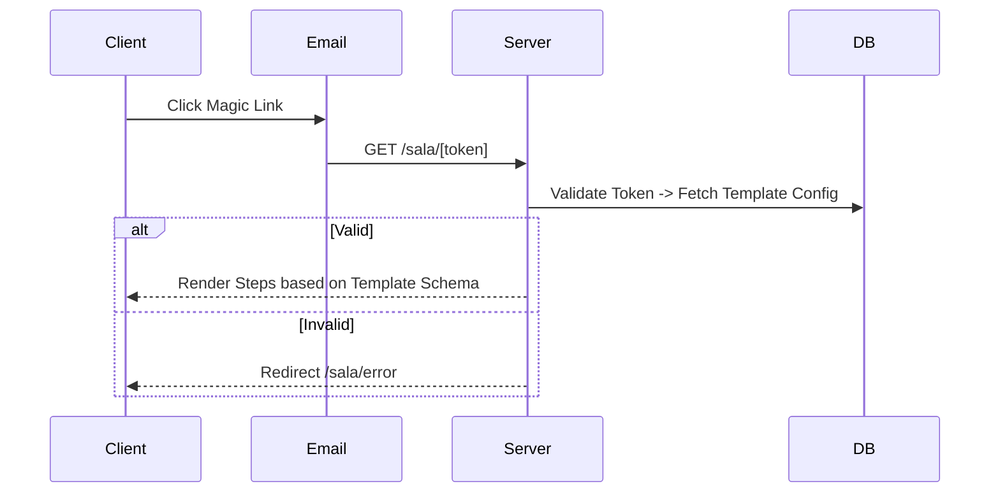

# Portal Module - Abogado Sala

Mobile-First Client Experience.

## 1. Flujo de Acceso (Zero Auth)

## 2. Máquina de Estados Dinámica (Schema Driven)

El Portal es un **Renderizador** del JSON Schema creado en el `Templates Module`.

1.  **Welcome Screen** (Si existe en JSON):
    - Muestra Título y Rich Text configurado por el abogado.
    - Botón "Comenzar".
2.  **ConsentStep** (Si `type: AGREEMENT` en JSON):
    - **Click Wrap Agreement**: Checkbox obligatorio.
    - PDF Viewer embebido.
3.  **DocumentUpload** (Exception Flow):
    - **Normal**: Cliente arrastra archivo. -> Upload -> OK.
    - **Exception**: Cliente clickea "¿No tienes este documento?".
      - Despliega `Textarea` (Slide down).
      - Label: "¿Por qué no lo tienes?".
      - Action: "Enviar Explicación".
      - Resultado: Paso marcado como "Completado con Excepción".
4.  **Completion Screen**:
    - Mensaje final personalizado.

## 3. Componentes Mobile y UX

- **No Signature Pad**: Checkbox simple para aceptación legal.
- **Exception Handling**: El flujo de "No lo tengo" debe ser claro pero no incentivar el abandono. Usar texto link discreto bajo el dropzone.
- **Auto-Save**: Al completar cada paso (Next), se guarda el progreso en DB.
- **Upload Button**: Sticky bottom en pantallas pequeñas.

## 4. Comparativa con `sala-cliente` (Legacy vs New)

| Feature          | Legacy (`sala-cliente`)     | New (`abogado-sala`)                    |
| ---------------- | --------------------------- | --------------------------------------- |
| **Firma**        | Canvas de dibujo (incómodo) | **Checkbox (Clickwrap)** - Rápido       |
| **Upload**       | Binario (Subes o no subes)  | **Exception Flow** (Subes o Explicas)   |
| **Pasos**        | Hardcoded                   | **Schema Driven** (Totalmente dinámico) |
| **Carga**        | Dynamic Imports básicos     | **Streaming + Skeletons** (Suspense)    |
| **Persistencia** | React State (Volátil)       | **URL + DB** (Resiliente)               |
