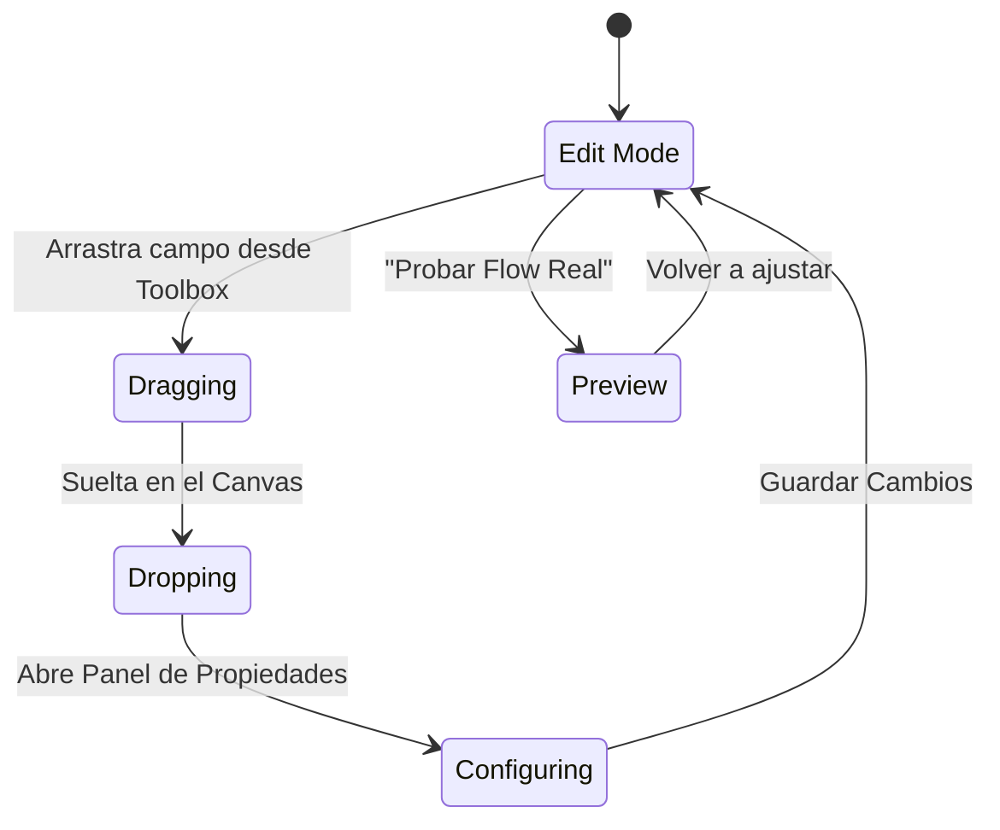

# Templates Module - Abogado Sala

Constructor de "Salas" y Flujos de Cliente. **El Core de la Personalización**.

## 1. Concepto: "The Flow Builder"

Ya no es solo un "cuestionario". Es un editor de **Experiencia de Usuario**.
El Abogado construye paso a paso lo que verá su cliente.

### Estructura de Datos (JSON Schema)

```json
{
  "welcome_screen": {
    "title": "Bienvenido, {client_name}",
    "body_rich_text": "<b>Instrucciones:</b> Por favor ten a la mano...",
    "button_text": "Comenzar"
  },
  "steps": [
    {
      "type": "AGREEMENT",
      "config": { "file_url": "...", "checkbox_text": "Acepto los términos" }
    },
    {
      "type": "UPLOAD",
      "config": {
        "required": true,
        "label": "DNI Frontal",
        "allow_exception": true // [NUEVO] Permite "No lo tengo"
      }
    }
  ],
  "completion_screen": {
    "message": "¡Gracias! Hemos recibido todo."
  }
}
```

## 2. Tipos de Campos (Form Builder)

El abogado tiene una "Toolbox" con estos bloques:

| Tipo                | Configuración Disponible               | UX Cliente              |
| ------------------- | -------------------------------------- | ----------------------- |
| **Texto Corto**     | Label, Placeholder, MaxLength          | `Input`                 |
| **Párrafo**         | Label, Lines                           | `Textarea`              |
| **Document Upload** | Required (Bool), **Allow Exception**   | `Dropzone` + "No tengo" |
| **Opción Única**    | Opciones (Array), Vista (Radio/Select) | `RadioGroup` o `Select` |
| **Opción Múltiple** | Opciones, Min/Max selecciones          | `Checkbox` List         |
| **Fecha**           | Rango permitido, Deshabilitar pasados  | `Calendar` Picker       |
| **Mensaje Info**    | Markdown Text (Sin input)              | `Alert` o Texto plano   |
| **Separador**       | Título de Sección                      | `Separator` + H3        |

## 3. Personalización de UI (Theming)

El abogado puede decidir (dentro de límites del sistema):

- **Mensajes**: "Personalizar mensaje de bienvenida" (Rich Text Editor simple).
- **Textos de Botones**: "¿Enviar" o "Continuar"?
- **Feedback**: Mensajes de éxito personalizados.

## 4. Flow del "Builder" (Drag & Drop)



## 5. Componentes UI Requeridos

- **RichTextEditor**: `TipTap` (versión light).
- **FormBuilderCanvas**: Lista sortable (`dnd-kit`).
- **PropertyPanel**: Sidebar derecho que cambia según el bloque seleccionado.
